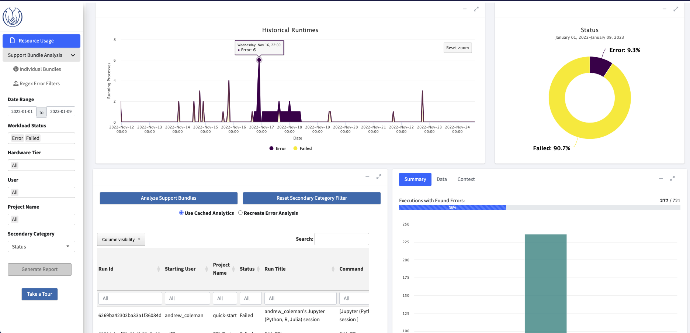
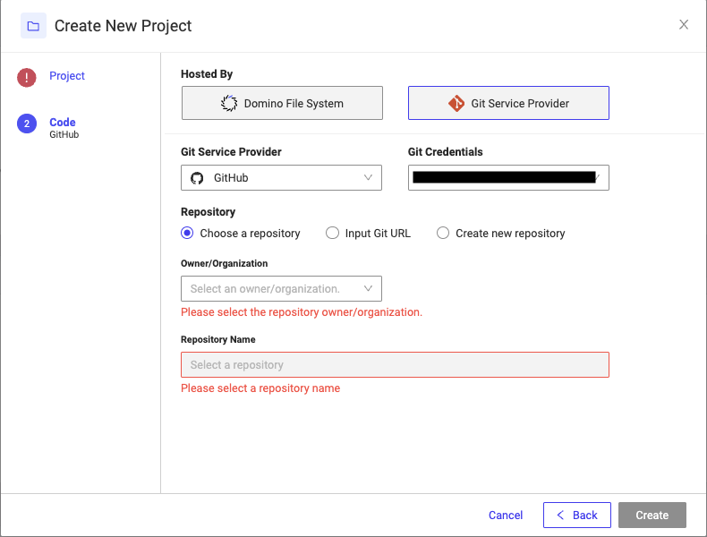

# Support Bundle Analysis Dashboard

This RShiny application aims to perform error identification and analysis of workloads executed in [Domino Data Lab](https://domino.ai/). The user can interact with subsets of the resource usage reports and trigger a regex extraction of the log files in support bundles for errors related to the cluster, domino, or the users themselves. To run the application, all that is needed is the execution file. At the time of creation, `R 4.3.1` was used.

```
./app.sh
```


--

## Table of Contents

1. [Data Sources](#data-sources)
2. [Installation](#installation)
3. [Environment](#environment) 
4. [Error Analysis Identification/Classification Methods](#error-analysis-identificationclassification-methods)
   
---

## Data Sources

### Resource Usage:

Gives a report of every execution and all related status metadata. These can be workspaces, jobs, or models. Example of a POST:

```
resource_usage_url <- paste0("https://", domino_url, "/admin/generateUsageReport")
payload <- paste0("start-date=", format(date_range[1], '%m/%d/%Y'), "&end-date=", format(date_range[2], '%m/%d/%Y'))
   
headers <- c(
     'Accept' = 'text/html,application/xhtml+xml,application/xml;q=0.9,image/avif,image/webp,image/apng,*/*;q=0.8,application/signed-exchange;v=b3;q=0.7',
     'Content-Type'= 'application/x-www-form-urlencoded',
     'X-Domino-Api-Key'= domino_user_api_key
   )
response <- httr::POST(url = resource_usage_url, body=payload, add_headers(headers))
```

Results are saved into local datasets, separating them by date into subdirectory `/mnt/data/{project_name}/resource-usage-by-day/`. This is then a cache for future queries.

### Support Bundles:

These logs are downloaded as zip files from each execution that can be found in the Resource Usage calls. Resulting files are largely unstructured text keeping track of processes happening in the underlying kubernetes infrastructure of Domino. The user can choose to execute an `analysis`, which takes the selected subset of executions and identifies errors in their log files. These errors are classified as cluster, domino, or user (in sequential hierarchy). Example GET:

```
zip_url <- paste0("https://", domino_url, "/v4/admin/supportbundle/", execution_id)
headers <- c("X-Domino-Api-Key" = domino_user_api_key)
        #response <- httr::GET(zip_url, add_headers(headers))
        
# Define the path to save the ZIP file
zip_file_path <- paste0(bundle_path, ".zip")  # Replace with the desired path
# Make the GET request and save the ZIP file
response <- GET(zip_url, add_headers(headers), write_disk(zip_file_path, overwrite = TRUE))
```

All support bundles are saved, with error analysis identification and classification saved as a summary to be used as a cache. The regular expression table found in subtab 'Regex Error Filters' can be edited and saved for future analysis. If updating this, you will want to trigger the 'Recreate Error Analysis' radio button to get the updated regex patterns searched.

---

## Installation

1. Fork this github repo. Be sure that you have your github credentials imported into the domino tenant. These settings can be found in the bottom left `Account > Settings > Git Credentials > Add Credentials`
2. Create a new project and import the forked repo:


   <b>Note:</b> When prompted for the environment, you will need to create and use the custom environment detailed in the following section.
4. Either in the forked github repo itself or in a created workspace on Domino, create a file in the mnt/code directory titled "credentials.R" with the following information:
```
#credentials.R:

domino_project_name <- <target_project_name>
domino_url <- <url-without-https://>
data_directory <- paste0("/mnt/data/", domino_project_name, "/")

# Optional! This is for the log error classifier if enabled. These are found via the API call for a deployed model
model_api_key <- <model-api-key>
model_rest_url <- <model-rest-url>

domino_user_api_key <- system("echo $DOMINO_USER_API_KEY", intern=TRUE)
```
This will be sourced at the beginning of startup.

4. Navigate to the `Publish > App` page and click `Yes, I have app.sh in my code directory`. That's it!

---

## Application Environment/Dockerfile

Before you can properly run the application, you need to create an environment that includes the various R packages that are used to perform ETL processes and visualize results. This can be done by navigating to `Environments > Create Environment`. Specify to `Customize before building` and use the existing base image `5.7 Domino Standard Environment Py3.9 R4.3.1`. Enter the following into `Dockerfile Instructions`:


```
RUN R --no-save -e 'install.packages(c("shiny", "shinydashboard", "DT", "digest", "data.table", "highcharter", "viridis", "shinyjs", "dplyr", "stringi", "httr", "tools", "magrittr", "lubridate", "bs4Dash", "shinycssloaders", "rintrojs", "crul"))'
```

--

## Error Analysis Identification/Classification Methods

### Regular Expression Patterns

In conducting the error analysis, the program parses through log files and identifies errors as hits on regular expression pattern matches. In this current iteration, regex expressions are manually maintained and can be edited via the `Regex Error Filters` tab.

The regex lookup table can be found under the path: [mnt/code/data/regex_lookup.csv](mnt/code/data/regex_lookup.csv)

### Machine Learning Model

<ol>
<li>Run analysis of “Error” and “Succeeded” support bundles for the desired amount of time. This should put the regex summaries into the support-bundle-summary directory within the dataset folder. 

<li> Run the runbook mentioned above (on a gpu instance) to train on all the logs. It will randomly sample lines from the “Succeeded” bundles and label them as “no error”. The frequency of this label is equal to the number of errors caught and classified via regex patterns (hence why step 1 is necessary).

<li> Once you have trained the model, update the model path in machine_learning/model.py and launch it via the model api. Take the <model-api-key> and the  <model-rest-url> and include it into the credentials.R file as outlined in the readme.
</ol>

**NOTE:** The model should only be used on a small number of support bundles due to time and resource constraints.


**Machine Learning Dockerfile**:
```
FROM nvcr.io/nvidia/pytorch:22.12-py3

# System-level dependency injection runs as root
USER root:root

# Validate base image pre-requisites
# Complete requirements can be found at
# https://docs.dominodatalab.com/en/latest/user_guide/a00d1b/automatic-adaptation-of-custom-images/#_pre_requisites_for_automatic_custom_image_compatibility_with_domino
RUN /opt/domino/bin/pre-check.sh

# Configure /opt/domino to prepare for Domino executions
RUN /opt/domino/bin/init.sh

# Validate the environment
RUN /opt/domino/bin/validate.sh


RUN pip install -q -U trl transformers accelerate git+https://github.com/huggingface/peft.git
RUN pip install -q datasets bitsandbytes einops mlflow langchain langsmith openai textstat evaluate rapidfuzz tiktoken
RUN pip install --no-cache-dir Flask Flask-Compress Flask-Cors jsonify uWSGI streamlit "ctranslate2==3.17.1"
RUN pip install seaborn
# RUN pip install streamlit-chat
RUN pip install -i https://test.pypi.org/simple/ streamlit-chat-domino 
RUN pip uninstall --yes transformer-engine
RUN pip uninstall -y apex

RUN pip uninstall --yes torch torchvision torchaudio

RUN pip install torch  --index-url https://download.pytorch.org/whl/cu118
```
